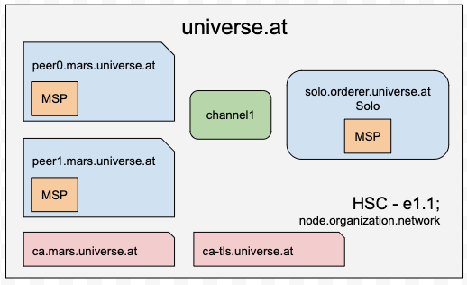

# Extension 1 of e01

In this extension of e01 we are going to extend the network with two fabric-ca Server.

- The first should deliver the TLS for the network.
- The second is to make the users available for the node.js SDK.
