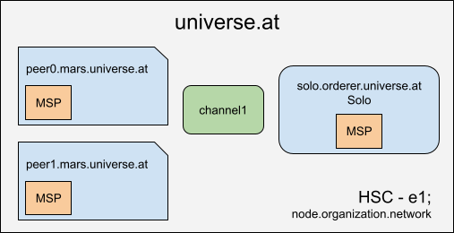

# Example 01 - one org network
## ToDos
- explanations regarding requirements
- explanations how to generate the artifacts
- install chaincode
- do some queries



The following fabric network characteristics should be built:

- a single organization
- one channel
- two peers
- one cli
- solo as ordering service
- predefined sacc chaincode
- without TLS


## Steps to start the network

```bash
# create the network artifacts
./generateArtifacts.sh

# open terminal 1 - start the network
docker-compose up

# open terminal 2 - check if the network is running
docker-compose ps

          Name                 Command       State                       Ports
---------------------------------------------------------------------------------------------------
cli                        /bin/bash         Up
peer0.mars.universe.at     peer node start   Up      0.0.0.0:7051->7051/tcp, 0.0.0.0:7053->7053/tcp
solo.orderer.universe.at   orderer           Up      0.0.0.0:7050->7050/tcp


# stop the network
docker-compose down

# use the cli container to switch into peer0
docker exec -it cli bash

root@e8e6b4d93749:/opt/gopath/src/github.com/hyperledger/fabric/peer#
exit

```


